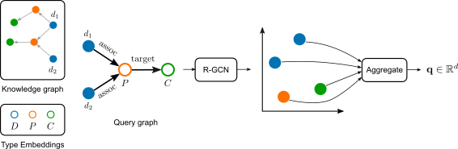

# Message Passing Query Embedding

This repository contains the implementation of MPQE, proposed in our paper [Message Passing Query Embedding](https://arxiv.org/abs/2002.02406). MPQE is  a model for answering complex queries over knowledge graphs, that learns embeddings of entities in the knowledge graph, and embeddings for variable types:


<div align="center">

</div>


### Requirements

We recommend creating a virtual environment, e.g. with `conda`. Use `requirements.txt` to install the dependencies:

```
conda create -n mpqe python=3.7
conda activate mpqe
pip install -r requirements.txt
```

As an additional dependency, we require PyTorch Geometric, which can be installed following [these instructions](https://github.com/rusty1s/pytorch_geometric#installation).


### Datasets

Datasets can be downloaded from the following links:

- [AIFB](https://surfdrive.surf.nl/files/index.php/s/2pX8SqAPH4Zm8D0/download)
- [MUTAG](https://surfdrive.surf.nl/files/index.php/s/i5WQLIzxqZSQlnN/download)
- [AM](https://surfdrive.surf.nl/files/index.php/s/7Z7z48HHqAwenls/download)

After downloading them, use `tar` to decompress them, e.g.

```sh
tar -xzf AIFB.tgz
```

This extracts a folder named `AIFB` , with two sub-folders: `raw` contains the triples that make up the Knowledge Graph, plus additional information. The `processed` folder contains training, validation, and test splits for the query answering task.


### Training

From the root directory of the repository, use the following commands to reproduce our experiments (here we show an example when the dataset of queries is at `AIFB/processed`):

**MPQE-TM**

```sh
python -m mpqe.train --data_dir='AIFB/processed' --adaptive --cuda
```

**MPQE-sum**

```sh
python -m mpqe.train --data_dir='AIFB/processed' --readout='sum' --cuda
```

For MPQE-max and MPQE-CMPL, replace `'sum'` in the previous command with `'max'` and `'concat'`, respectively.


Using a GTX 1080 Ti NVIDIA GPU, training the models takes around 3 to 6 hours.

